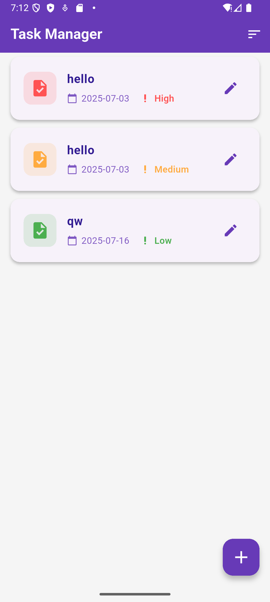
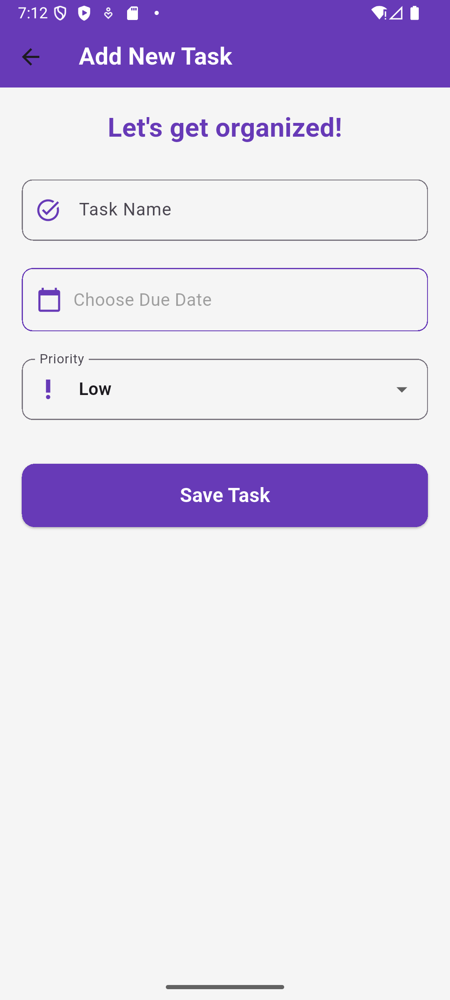
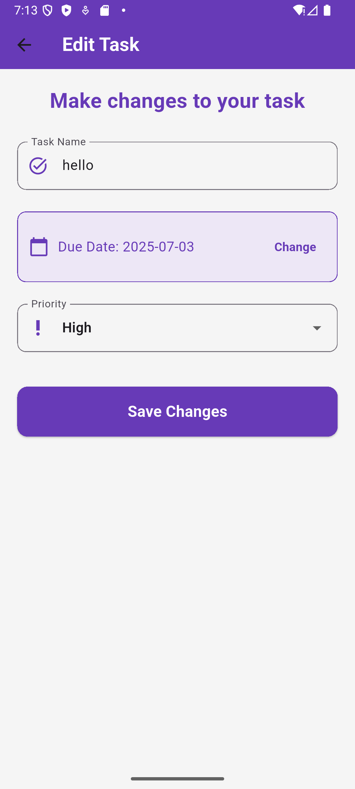
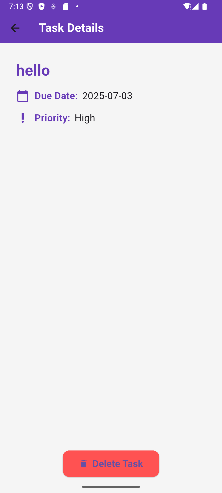
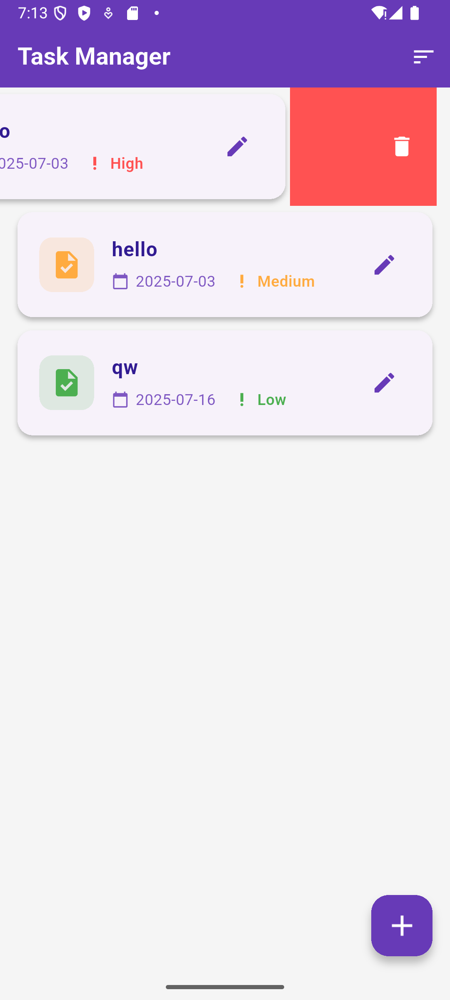

# Task Manager Hybrid App

A Flutter-based task management app with SQLite, SharedPreferences, and motivational quotes API.

---

## Features

- Add, edit, delete tasks with name, due date, and priority.
- Sort tasks by date or priority.
- Persistent user preferences using SharedPreferences.
- Motivational quotes fetched from an external API.
- Sleek, modern UI design.

---

## Screenshots

<div align="center">

### Task List Screen
  
_A clean and organized list of tasks with swipe-to-delete and sorting options._

---

### Add Task Screen
  
_Add new tasks easily with due date picker and priority selection._

---

### Edit Task Screen
  
_Edit existing tasks with intuitive controls and save changes._

---

### Task Detail Screen
  
_View detailed task info and delete if needed._

---

### Motivational Quote & Sorting
  
_Get daily motivational quotes and sort your tasks for better productivity._

</div>

---

## Setup & Usage

1. Clone the repo:

   ```bash
   git clone https://github.com/dhruvjivani/task_manager_hybrid_app.git

Navigate to the project folder:

bash
Copy
Edit
cd task_manager_hybrid_app
Get dependencies:

bash
Copy
Edit
flutter pub get
Run the app:

bash
Copy
Edit
flutter run
Git Remote
Add your remote origin:

bash
Copy
Edit
git remote add origin https://github.com/dhruvjivani/task_manager_hybrid_app.git
Technologies
Flutter

SQLite

SharedPreferences

HTTP for API calls

License
MIT License © Dhruv Jivani

Made with ❤️ and Flutter magic!

yaml
Copy
Edit

---

This adds a nice structure with captions and horizontal dividers between screenshots, aligned center for better aesthetics.

If you want me to generate the actual file for you to download and add directly, just say!